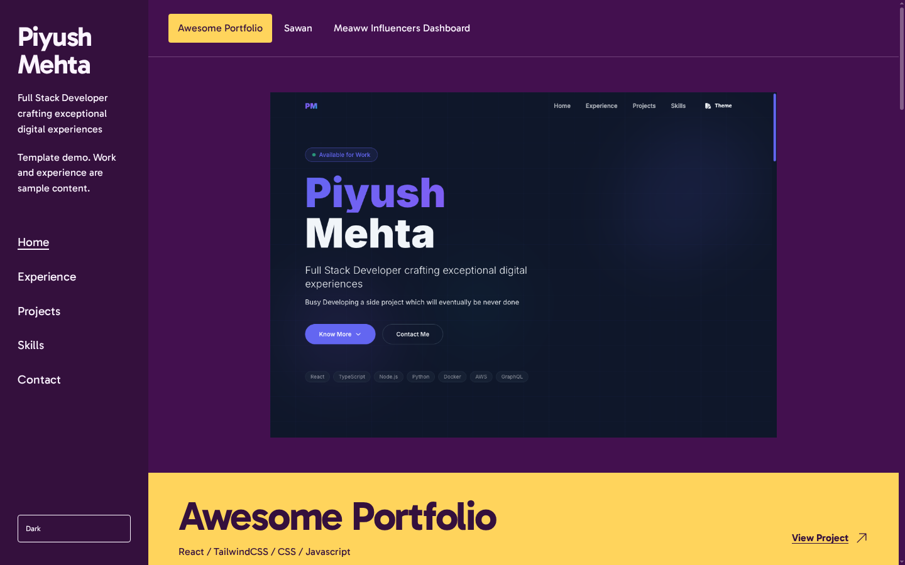
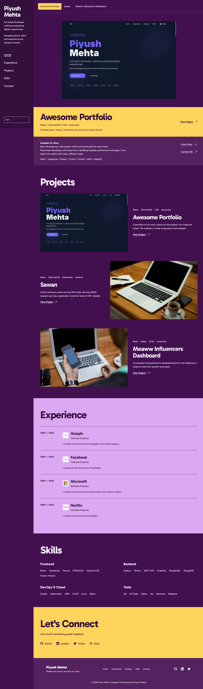
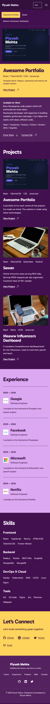
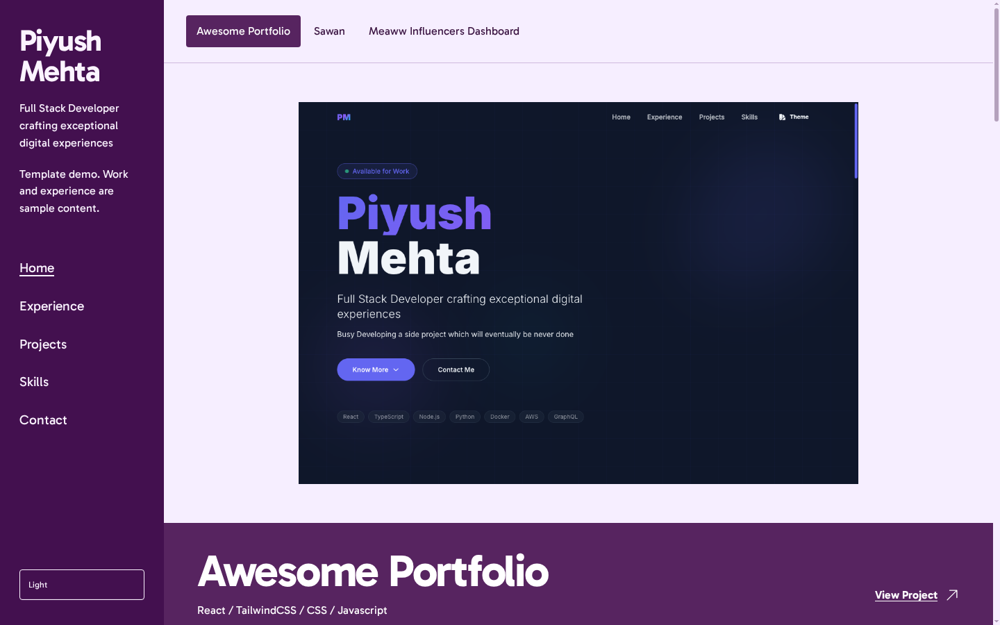

# Awesome Portfolio

A work-first developer portfolio template. Featured projects take the stage, a compact programme rail handles navigation, and experience, skills, and contact follow in one page.

[](https://github.com/piyush97/awesome-portfolio/actions/workflows/ci.yml)
[](LICENSE)

[Hosted demo](https://awesome-portfolio-beta.vercel.app/) · [Get started](#quickstart) · [Customize](#make-it-yours) · [Deploy](#deployment)



> The bundled names, employers, projects, links, and metrics are demonstration content, not verified personal achievements. Keep `IS_DEMO` enabled until you have replaced them with your own facts.

## Screenshots

Fresh captures of the redesigned application, using the bundled demo content. Desktop captures use a 1440 × 900 browser viewport; mobile uses 390 × 844. Full-page images include the content below the first viewport.

<details>
<summary>Full desktop page</summary>



</details>

<details>
<summary>Mobile layout</summary>



</details>

<details>
<summary>Light theme</summary>



</details>

The older portfolio screen shown *inside* the featured project is an intentional demo-project preview. Documentation captures live in `docs/screenshots/`; `demo-hero.png` remains an application asset and should not be overwritten when refreshing this README.

## What is included

- **Work-first presentation:** select a featured project to change its preview, technologies, title, and destination; browse the full project collection below.
- **Responsive navigation:** a desktop side rail becomes a compact mobile header with an expandable menu. Section links use native fragment anchors.
- **Four themes:** Dark (`modern-dark`), Light (`modern-light`), Cupcake, and Bumblebee. Selection applies immediately; a page reload starts in Dark again.
- **Keyboard and motion support:** native buttons, links and theme selection; a skip-to-content link; visible focus states; Enter/Escape mobile-menu handling; reduced-motion overrides.
- **Centralized portfolio data:** identity, contact links, projects, experience, skills, and SEO inputs are exported from one data module.
- **Correct date years:** experience dates use UTC year extraction, with `"Present"` supported for an ongoing role.
- **Local typography:** the Gabarito variable font is self-hosted, with its license included.

## Quickstart

Use **Node.js 24 LTS** to match CI and **Yarn Classic 1.22** with the committed `yarn.lock`.

```bash
git clone https://github.com/piyush97/awesome-portfolio.git
cd awesome-portfolio
yarn install --frozen-lockfile
yarn start
```

Open **http://localhost:3000**. Edit [`src/data/data.tsx`](src/data/data.tsx) while the development server is running.

If you prefer npm, use `npm install` and the equivalent `npm run <script>` commands. This repository maintains a Yarn lockfile, not an npm lockfile.

### Commands

| Command | Purpose |
|---|---|
| `yarn start` | Vite development server; configured port `3000` |
| `yarn lint` | Oxlint over `src/`; warnings fail the check |
| `yarn build` | TypeScript check followed by a production build into `build/` |
| `yarn preview` | Serve the production build locally after `yarn build` |

CI installs with a frozen lockfile, runs lint, and builds on Node.js 24. There is currently no separate test script.

## Make it yours

### 1. Replace the portfolio content

[`src/data/data.tsx`](src/data/data.tsx) is the content entry point:

| Export | What it controls |
|---|---|
| `NAME`, `URL` | Developer identity and published portfolio URL |
| `IS_DEMO` | Disclosure that projects, experience, and metrics are sample content |
| `TAGLINE`, `ABOUT` | Developer introduction |
| `GREETING_TEXT`, `GREETING_DESCRIPTION` | Availability and introduction copy |
| `CTA_TEXT`, `CONTACT_TAGLINE` | Introduction action label and contact copy |
| `SOCIAL_LINKS` | GitHub, LinkedIn, Twitter, and email destinations |
| `projects` | Both the featured-project selector and the project collection |
| `EXPERIENCE` | Company, role, dates, logo, and description |
| `SKILLS_GROUPED` | Rendered skill categories and skill words |
| `TECH_STRIP` | Curated technology line in the introduction |
| `MENU`, `SECTIONS` | Navigation labels, fragment destinations, and section titles |
| `KEYWORDS`, `IMAGE` | SEO keywords and social-preview image |
| `TEMPLATE_AUTHOR` | Template attribution, independent of the portfolio owner |

The legacy `skills` array is not the rendered skills section; edit `SKILLS_GROUPED` instead.

Update social links with full URLs. Email destinations should use `mailto:`:

```tsx
export const SOCIAL_LINKS: SocialLinks = {
  github: "https://github.com/your-username",
  linkedin: "https://www.linkedin.com/in/your-username",
  twitter: "https://twitter.com/your-username",
  email: "mailto:you@example.com",
};
```

Navigation destinations must match actual section IDs. Adding a new menu item alone does not create a section.

### 2. Add your project images and experience

Place a project screenshot in `src/assets/`, import it into the data module, and use it as `projectImageLogo`:

```tsx
import ProjectPreview from "../assets/my-project.png";

export const projects: ProjectCardProps[] = [
  {
    id: 1,
    projectName: "My Project",
    projectDescription: "A factual description of what you built.",
    projectImageLogo: ProjectPreview,
    tech: ["React", "TypeScript"],
    link: "https://your-project.example",
    buttonText: "View Project",
  },
];
```

Use unique project IDs. Images are shared between the featured stage and the collection; the demo's stock laptop photographs are illustrative, not product screenshots. Replace them with useful images of your own work.

For experience, use ISO date-only strings such as `"2024-06-01"` for `start` and `end`, or `"Present"` for `end`. Replace the sample company logos and descriptions too.

Shared data shapes are defined in [`src/types/types.d.ts`](src/types/types.d.ts).

### 3. Review metadata, then remove demo labels

- Set `URL`, `NAME`, `KEYWORDS`, and `IMAGE` for your published site.
- Replace the favicon and other relevant icons in `public/`; update [`public/site.webmanifest`](public/site.webmanifest).
- Confirm project, social, and email links point to your destinations.
- After replacing **all** sample facts, set `IS_DEMO = false`.

React renders the page title and SEO tags through [`src/components/Seo.tsx`](src/components/Seo.tsx). The manifest is site metadata; this template does not include a service worker or offline caching.

## Themes and layout

The visual system is documented in [`DESIGN.md`](DESIGN.md); durable product context lives in [`PRODUCT.md`](PRODUCT.md).

- Theme palettes and global layout are authored in [`src/index.css`](src/index.css), using Tailwind CSS v4 and daisyUI v5 directives.
- [`src/utils/themeList.tsx`](src/utils/themeList.tsx) contains the selector's enabled theme names.
- The desktop rail is 236px wide. At 1099px and below it becomes a top header; at 640px and below the work collection stacks.
- One native CSS transition accompanies an intentional project change. Reduced-motion preference disables animation, transitions, and smooth scrolling.

When adding a theme, update both the enabled CSS theme configuration and the selector list. Keep foreground/background contrast and focus visibility intact.

## Project map

```text
src/
  components/   Featured stage, navigation, cards, contact, and SEO
  containers/   Section order and data-to-view composition
  context/      Shared theme state
  data/         Editable portfolio content
  types/        Shared TypeScript data and prop shapes
  index.css     Themes, typography, layout, and motion
public/
  fonts/        Gabarito variable font and SIL Open Font License
  site.webmanifest
docs/
  screenshots/  Current README captures, separate from application previews
```

## Stack

| Area | Technology |
|---|---|
| UI | React 19 and TypeScript 7 |
| Development/build | Vite 8 |
| Styling | Tailwind CSS 4 and daisyUI 5 |
| Icons | Heroicons |
| Page metadata | `react-helmet-async` |
| Motion/navigation | Native CSS and fragment anchors; no animation library or router |
| Lint | Oxlint |

[`package.json`](package.json) is authoritative for current versions and scripts.

## Deployment

Run the checks and inspect the built site before publishing:

```bash
yarn lint
yarn build
yarn preview
```

Check your real content on desktop and mobile, tab through links and controls, try every enabled theme, and test reduced motion.

### Vercel or Netlify

Import your repository into the hosting provider and use:

| Setting | Value |
|---|---|
| Install command | `yarn install --frozen-lockfile` |
| Build command | `yarn build` |
| Output/publish directory | `build` |
| Node version | `24` |

[Deploy with Vercel](https://vercel.com/new/clone?repository-url=https%3A%2F%2Fgithub.com%2Fpiyush97%2Fawesome-portfolio) · [Deploy with Netlify](https://app.netlify.com/start/deploy?repository=https://github.com/piyush97/awesome-portfolio)

### GitHub Pages or another subpath host

For a project site such as `https://username.github.io/awesome-portfolio/`, set the Vite base path:

```bash
yarn build --base=/awesome-portfolio/
```

Publish the contents of `build/` through your hosting workflow. For GitHub Pages, configure the publication source under **Settings > Pages**.

Check static manifest URLs for the same base path: the current icon paths in `public/site.webmanifest` are root-relative, and public JSON files are not rewritten by Vite. Update the portfolio `URL` too. The included CI workflow checks the application; it does not deploy it.

## Contributing and license

See [`contributing.md`](contributing.md) for contribution guidance and [`MAINTAINING.md`](MAINTAINING.md) for maintenance commands and CI details.

The application is [MIT licensed](LICENSE). The bundled Gabarito font uses the [SIL Open Font License](public/fonts/OFL.txt).
